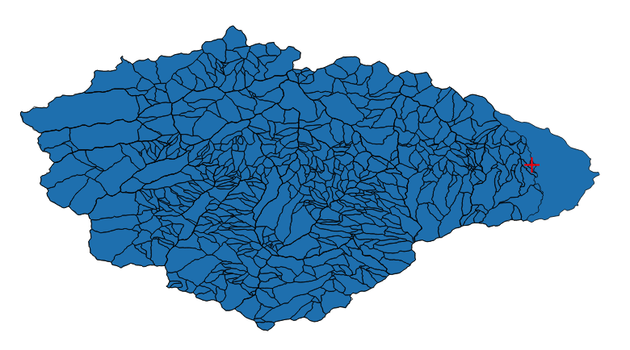
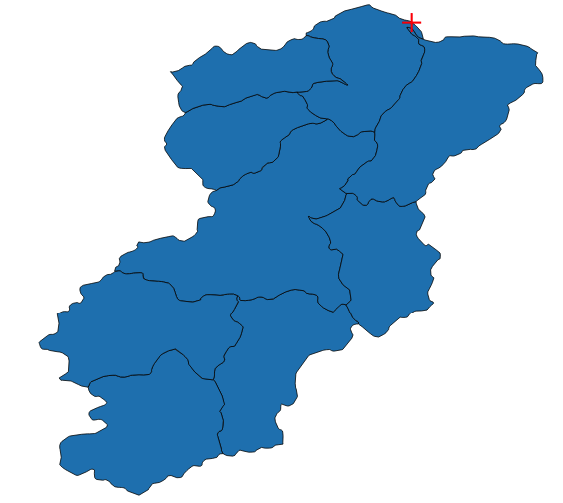
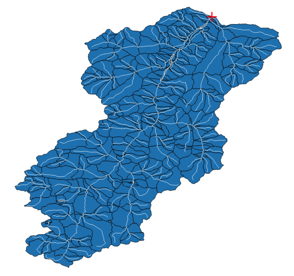
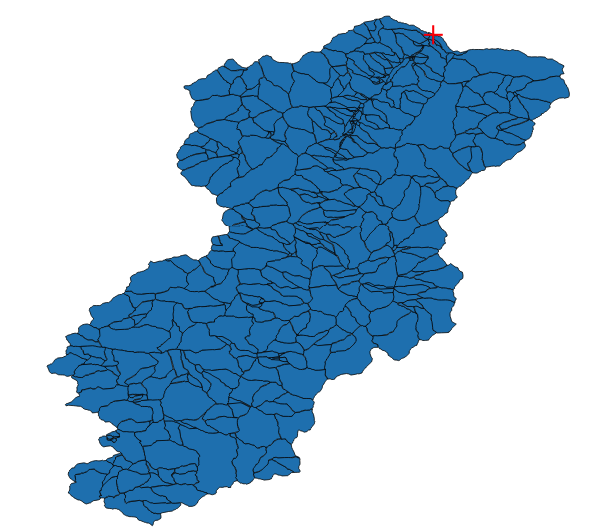
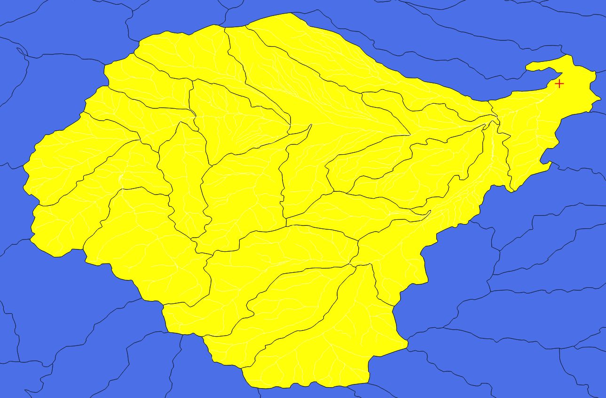
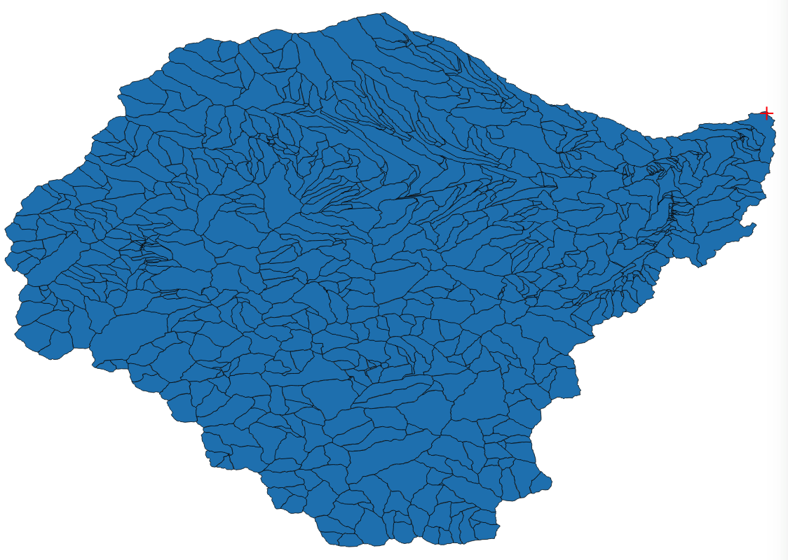
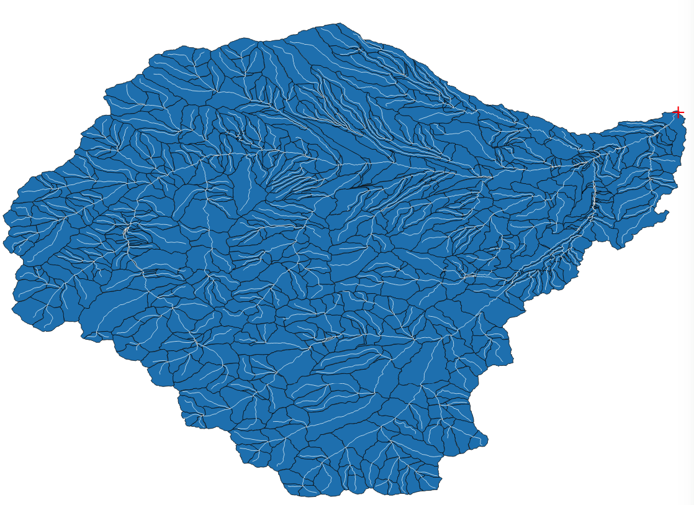

# Master list
* 06218500    Wind River nr Dubois
* 06221400    Dinwoody Creek above Lakes near Burris
* 06224000    Bull Lake Creek above Bull Lake
* 06220800    Wind River above Red Creek near Dubois
* 06225500    Wind River near Crowheart  
* 0303WR01    Wind River at Hwy 26 Bridge near Morton
* 06227600    Wind River near Kinnear    
* 0301PA01    Middle Popo Agie River below the Sinks near Lander
* 0301PA02    Little Popo Agie River near Lander
* 06232000    North Fork Popo Agie River nr Milford
* 06228350    South Fork Little Wind R. Above Washakie Res.
* 06235500    Little Wind River near Riverton
* 06253000    Fivemile Creek near Shoshoni
* 06259000    Wind River below Boysen Reservoir  
* 06258000    Muddy Creek nr Shoshoni
* 0305OC01    South Fork Owl Creek above Anchor Reservoir
* 0305OC11    North Fork Owl Creek near Anchor Reservoir
* 0305OCBL    South Fork Owl Creek below Anchor Reservoir
* 0305OC03    Owl Creek at Arapahoe Ranch
* 0314CW01    Cottonwood Creek at High Island Ranch near Hamilton Dome
* 0303BH07    Bighorn River nr Worland
* 0306NW04    Nowood River near Manderson
* 06274300    Bighorn River near Basin
* 06276500    Greybull River near Meeteetse
* 06278500    Shell Creek nr Shell
* 06279500    Bighorn River near Kane
* 06280300    South Fork Shoshone River near Valley
* 06279940    North Fork Shoshone River at Wapiti
* 06285100    Shoshone near Lovell

# Selected basins for calibration

* 06279940 North Fork Shoshone near Wapiti (nearly undepleted)
* 06280300 South Fork Shoshone near Valley (nearly undepleted)
* 06218500 Wind River nr Dubois (mostly undepleted)
* 06224000 Bull Lake Creek ab Bull Lake (undepleted)
* 06221400 Dinwoody Creek above Lakes nr Burris (undepleted)
* 06278500 Shell Creek nr Shell (almost undepleted, small reservoir above)
* 06276500 Greybull R at Meeteetse (depleted)

# Workflow
## SUMMA
* All calib basins work situated here: `/gpfs/fs1/work/manab/fcast/basins`
* Convert USGS lat-long from DMS to Decimal Degrees using this tool: https://www.latlong.net/degrees-minutes-seconds-to-decimal-degrees
* Identify the HUC-12s using shapefiles: 1) wUS_HUC_12_Simplified 2) Flowline_MS_10U (Upper Missouri)
* Attributes
    * Create attributes using the new script: `/gpfs/fs1/work/manab/fcast/basins/master/attributes/extract_usingindices.py`
    * Change the HRU IDs from QGIS visual inspection
* Create ColdStates file using the new script: `/gpfs/fs1/work/manab/fcast/basins/master/coldstates/extract_usingindices.py`
* Forcing
    * `/gpfs/fs1/work/manab/fcast/basins/master/forcing/extract_usingindices.py`
    * Change the outdir and script will subset for each HRU set and year
* Param trials
    * `/gpfs/fs1/work/manab/fcast/basins/master/paramtrials/extract_usingindices.py`
    * Change HRU IDs
* TODO: Possible optimization - wrapper around all the 4 scripts above.

## Routing Data Prep
* Shapefiles:
    * HUC-12
    * NHDPlusv2 - flowlines and polygon
* Create basin shapefiles for flowlines and polygon by basin dileneation: `/gpfs/fs1/work/manab/fcast/pfaf_decode/scripts/get_subbasin.py`
* `wUS_HUC_12_simplified`
    * Open in QGIS and open attribute table
    * Use expression to subset only contributing HRUs:
    ```
    "HUC_12"  IN ('100800120101', '100800120102', '100800120103', '100800120104', '100800120105', 
    '100800120201', '100800120202', '100800120203', '100800120204', '100800120205', '100800120206', '100800120207', '100800120208', '100800120209', 
    '100800120301', '100800120302', '100800120303')
    ```
    * Save layer -> Select only selected features -> Save as gpkg. Also save as shapefile
* Poly2poly
    * Put all the basin gpkg files here: `/gpfs/fs1/work/manab/fcast/basins/route/dataprep/basins`
    * The main package of scripts is here: `/gpfs/fs1/work/manab/fcast/basins/route/dataprep/package.2015.12.16`
    * *NOT WORKING ON CHEYENNE DUE TO GDAL COMPATIBILITY ISSUES* 
    * On hydro-c1: `/d3/msaharia/SHARP/package.2015.12.16/qsub_poly2poly_mnb_basins.sh`
    * Transfer HUC-12 gpkp to `/d3/msaharia/SHARP/package.2015.12.16/basins`
    * A mapping file `poly.nc` will be formed in `/d3/msaharia/SHARP/package.2015.12.16/basins/*/HUC_12`
    * Creates mapping file in NHDPlus folder which I transfer back to Cheyenne
    * Make `intersector` in mapping file from string to int64
*  
# Calibration 
## Initial stages
* Objective function: KGE
* Parameters - 7
```
winterSAI                 | WLAITEMP|       0.0100 |       3.0000
summerLAI                 | SLAITEMP|       0.0100 |      10.0000
k_soil                    | KSOILTEMP|       1.d-07 |     100.d-07
specificStorage           | SSTEMP|       1.d-05 |       1.d-07
aquiferBaseflowRate       | ABFRTEMP|       0.0000 |       0.1000
aquiferBaseflowExp        | ABFETEMP|       1.0000 |      10.0000
canopyWettingFactor       | CWFTEMP|       0.0000 |       1.0000
```


# Basins
## 06279940 North Fork Shoshone near Wapiti
### Analysis: [06279940.ipynb](06279940.ipynb)
* https://waterdata.usgs.gov/wy/nwis/nwismap/?site_no=06279940&agency_cd=USGS
* Latitude  44°28'11", Longitude 109°25'47", 
* Lat, long: 44.4697222, -109.42972222
* Hydrologic Unit Code 10080012
* HUC-12 IDs within this basin (wUS_HUC12_simplified):
    * 100800120101, 100800120102, 100800120103, 100800120104, 100800120105, 100800120201, 100800120202, 100800120203, 100800120204, 100800120205, 100800120206, 100800120207, 100800120208, 100800120209, 100800120301, 100800120302, 100800120303
* Route COMID: 940080033



## 06280300 South Fork Shoshone near Valley
### Analysis: [06280300.ipynb](06280300.ipynb)

* https://waterdata.usgs.gov/nwis/inventory/?site_no=06280300&agency_cd=USGS
* Latitude 44°12'28.4",   Longitude 109°33'18.9"  
* 44.20788889, -109.55527778
* Hydrologic Unit 10080013
* COMID 12787632, PFAF 896865973
* Outlet
    * FLOWLINE COMID: 12788124, PFAF 896865973
    * NHDPLUS HUC FEATUREID: 12788124, PFAF: 896865973
* HUC-12s: 100800130203, 100800130201, 100800130202, 100800130106, 100800130104, 100800130105, 100800130103, 100800130102, 100800130101





### 06218500 Wind River nr Dubois
* https://waterdata.usgs.gov/nwis/inventory/?site_no=06218500&agency_cd=USGS
* Latitude 43°34'43",   Longitude 109°45'33" 
* 43.57861111, -109.75916667
* Hydrologic Unit 10080001
* pfaf code for reach: 89699933

### 06224000 Bull Lake Creek ab Bull Lake
* https://waterdata.usgs.gov/nwis/inventory/?site_no=06224000&agency_cd=USGS
* Latitude 43°10'35.8",   Longitude 109°12'09.2" 
* 43.17661111, -109.20250000
* Hydrologic Unit 10080001
* pfaf code for reach: 8969941175

### 06221400 Dinwoody Creek above Lakes nr Burris
* https://waterdata.usgs.gov/wy/nwis/inventory/?site_no=06221400&agency_cd=
* Latitude 43°20'46.2",   Longitude 109°24'31.6"
* 43.34616667, -109.40888889
* Hydrologic Unit 10080001
* pfaf code for reach: 89699581173

### 06278500 Shell Creek nr Shell
* https://waterdata.usgs.gov/nwis/inventory/?site_no=06278500&agency_cd=USGS 
* Latitude 44°33'54",   Longitude 107°42'44"
* 43.56500000, -107.71222222
* Hydrologic Unit 10080010
* pfaf code for reach: 89696697

###  06276500 Greybull R at Meeteetse
* https://waterdata.usgs.gov/nwis/inventory/?site_no=06276500&agency_cd=USGS
* Latitude 44°09'30.7",   Longitude 108°52'21.3"  
* 44.15852778, -108.87250000  
* Hydrologic Unit 10080009
* pfaf code for reach: 89692571
* "HUC_12"  IN ('100800090302', '100800090301', '100800090111', '100800090112', '100800090204' , '100800090203', 
'100800090202', '100800090201', '100800090101' , '100800090102', '100800090103' , 
'100800090104', '100800090106', '100800090105', '100800090107', '100800090110', '100800090109', '100800090108', '100800090205')


 
